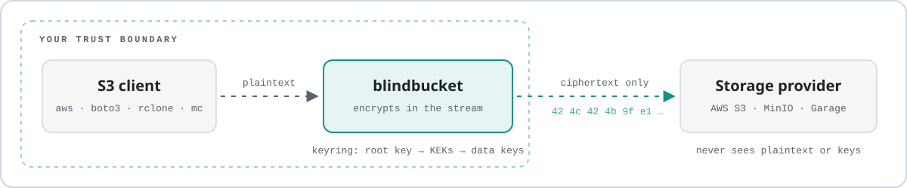

  <picture>
    <source media="(prefers-color-scheme: dark)" srcset="assets/banner-dark.svg">
    
  </picture>

  
  
  

I'm a computer science student at the University of Münster and a working student in IT.
Most of what I build sits where security and AI meet: encryption that a storage provider
cannot see through, and tooling that lets language models work with real data and real
accounts without leaking either.

I would rather make a smaller claim I can back up than a bigger one I can't. The numbers
below come from benchmarks and test runs you can reproduce, and each security project says
up front what it does **not** protect against.

## Flagship — blindbucket

<picture>
  <source media="(prefers-color-scheme: dark)" srcset="assets/blindbucket-dark.svg">
  
</picture>

**[blindbucket](https://github.com/LennardGeissler/blindbucket)** is a transparent S3
encryption gateway in Go. Clients keep speaking ordinary S3 — AWS CLI, boto3, rclone, `mc` —
and only the endpoint changes. Objects are sealed with AES-256-GCM in 64 KiB chunks as
they stream through, so memory depends on how many uploads are in flight, never on how
large they are. Key rotation, a signed audit log, object-name encryption, rollback detection,
and a keyring that Vault Transit or AWS KMS can unseal. Now at `v1.0.0`.

<table>
  <tr>
    <td align="center" valign="top" width="25%"><h3>38.5 M</h3>states in a TLA+ model of the multipart lifecycle, no counterexample</td>
    <td align="center" valign="top" width="25%"><h3>0.5 MiB</h3>peak Go heap to encrypt and decrypt 10 GiB, identical SHA-256</td>
    <td align="center" valign="top" width="25%"><h3>3 providers</h3>MinIO and Garage on every change, AWS S3 + KMS on demand</td>
    <td align="center" valign="top" width="25%"><h3>21 ADRs</h3>plus a threat model and a byte-level format spec</td>
  </tr>
</table>

  <a href="https://github.com/LennardGeissler/blindbucket/blob/main/docs/THREAT_MODEL.md">Threat model</a> ·
  <a href="https://github.com/LennardGeissler/blindbucket/blob/main/docs/FORMAT.md">Format spec</a> ·
  <a href="https://github.com/LennardGeissler/blindbucket#a-race-in-my-own-design-and-the-machine-that-found-it">The race the model checker found</a> ·
  <a href="https://github.com/LennardGeissler/blindbucket#numbers">Benchmarks</a>

## More at the intersection

<table>
  <tr>
    <td width="50%" valign="top">

### [ai-compliance-copilot](https://github.com/LennardGeissler/ai-compliance-copilot)

A browser extension that catches PII, credentials and secrets in prompts to ChatGPT,
Claude, Gemini and Perplexity — **on-device, before the request leaves the browser**.
Allow / warn / block policies and one-click redaction. No backend, no telemetry.

TypeScript · Manifest V3 · 7 outside contributors

</td>
    <td width="50%" valign="top">

### [google-tasks-mcp](https://github.com/LennardGeissler/google-tasks-mcp)

Google Tasks as a Claude.ai custom connector. The Worker is its **own OAuth 2.1 server**
(PKCE S256, dynamic client registration); the Google refresh token is stored
AES-GCM-encrypted, and the server is locked to exactly one account.

TypeScript · Cloudflare Workers · both MCP protocol generations

</td>
  </tr>
  <tr>
    <td width="50%" valign="top">

### [ai-pr-reviewer](https://github.com/LennardGeissler/ai-pr-reviewer)

A self-hosted GitHub Action that reviews pull requests with Claude — bugs, security and
performance, not style. It treats the diff as **untrusted input** and flags
prompt-injection attempts instead of following them.

TypeScript · GitHub Actions · bring your own key

</td>
    <td width="50%" valign="top">

### [mcp-claude-bridge](https://github.com/LennardGeissler/mcp-claude-bridge)

Lets stdio-only MCP clients such as Claude Desktop reach **remote MCP servers** over
SSE. Reconnect with capped backoff, auth headers, graceful shutdown — in one static
binary with zero dependencies.

Go · Windows, macOS, Linux

</td>
  </tr>
</table>

Also: <a href="https://github.com/LennardGeissler/xinvo">xinvo</a>, a Go CLI that inspects and validates ZUGFeRD / Factur-X e-invoices ·
<a href="https://github.com/LennardGeissler/tiktok-ads-mcp">tiktok-ads-mcp</a>, an MCP server for the TikTok Marketing API (alpha)

## Now and next

<picture>
  <source media="(prefers-color-scheme: dark)" srcset="assets/roadmap-dark.svg">
  
</picture>

### Applied cryptography in Go

Most of what I learn right now comes out of [blindbucket](https://github.com/LennardGeissler/blindbucket).
Encrypting a stream of unknown length is a different problem from encrypting a file: every
64 KiB chunk carries its own AES-GCM tag, and each nonce carries the chunk's index and a
final flag, so a truncated, reordered or duplicated stream fails to decrypt instead of
quietly coming back shorter.

The systems side is just as interesting — zero allocations
per chunk, and a download path that aborts the connection rather than hand out a byte it
could not authenticate. Where stateless instances race on the same object, I write the
rules down as a TLA+ model and let a model checker look for the interleaving I missed.
Next for the project: Cloudflare R2, Backblaze B2 and benchmarks over a real network.

### AI, connected safely

The model is rarely the hard part. The boundary is: what an assistant may reach, with
whose credentials, and what happens when its input is hostile.
[google-tasks-mcp](https://github.com/LennardGeissler/google-tasks-mcp) answers the first
two as its own OAuth 2.1 server — PKCE, dynamic client registration, a refresh token
stored encrypted, one account and no other.
[ai-pr-reviewer](https://github.com/LennardGeissler/ai-pr-reviewer) answers the third by
treating every diff as untrusted input, and
[ai-compliance-copilot](https://github.com/LennardGeissler/ai-compliance-copilot) keeps
sensitive data from reaching a model in the first place. MCP is where I keep learning
this, because it is where AI meets real accounts.

### Private inference · XAI

From October 2026 I'm starting on two topics, and both sit right at the intersection.
Privacy-preserving neural network inference with secret sharing runs a model on inputs
that are split into shares, so that no single party ever sees the data. Explainable AI
asks for the opposite: to make a model's decision visible. The question I'm most curious
about is where the two collide — how much can you explain about a decision whose input
nobody is allowed to see?

If you work on any of this, I'd be glad to hear from you.

## How I work

- **Measure, then claim.** blindbucket's numbers come with the scripts that produced them,
  and its compatibility table lists only the providers its test suite has actually run against.
- **Limits first.** blindbucket and ai-compliance-copilot each ship a threat model that
  names what stays exposed; ai-pr-reviewer tells you to treat its output as advisory,
  because no prompt-injection defence is bulletproof.
- **Check the design, not only the code.** A TLA+ model of blindbucket's multipart
  lifecycle showed that swapping two read-only steps — the kind of edit that passes review
  because neither changes anything — leaves objects unreadable. That trace is now a regression test.
- **AI as a tool, not an oracle.** I use Claude Code every day for planning, implementation
  and review. What it produces goes through the same tests and review as code I type myself.

## Toolbox

<table>
  <tr><td><b>Security</b></td><td>AEAD and envelope encryption · key rotation · threat modelling · TLA+ · fuzzing · OAuth 2.1 / PKCE · AWS KMS, Vault Transit</td></tr>
  <tr><td><b>AI</b></td><td>Model Context Protocol (servers, transports, auth) · Claude API · prompt-injection-aware tooling · on-device detection</td></tr>
  <tr><td><b>Languages</b></td><td>Go · TypeScript · Python</td></tr>
  <tr><td><b>Platforms</b></td><td>Docker · GitHub Actions with OIDC · AWS · Cloudflare Workers · React, Node.js</td></tr>
</table>

 

  Münster, Germany · German &amp; English · <a href="https://www.linkedin.com/in/lennard-geissler">LinkedIn</a>

